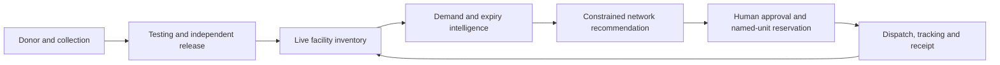
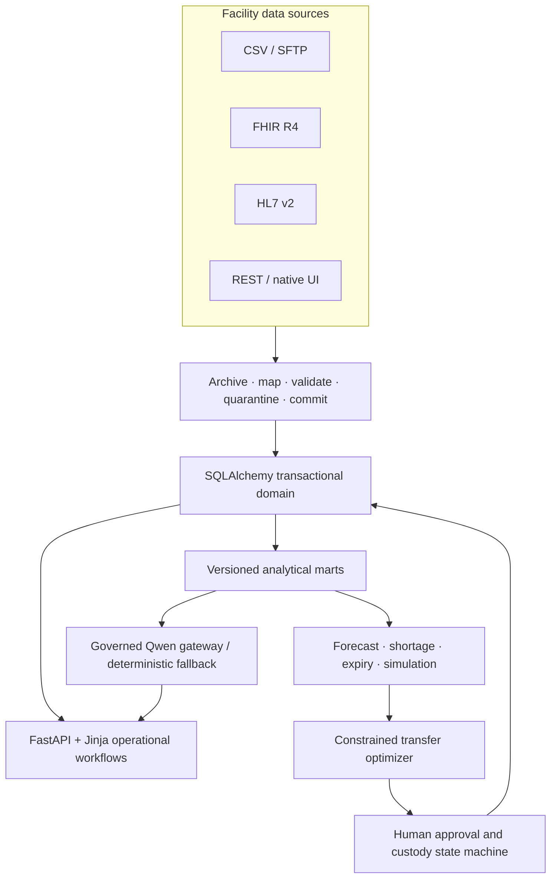

# Rabta-e-Hayat

**A governed blood-supply operating network for Pakistan — from donor registration to predictive, accountable redistribution.**

Rabta-e-Hayat combines a complete blood-bank management workflow with demand forecasting, expiry-risk rescue, constrained transfer planning, emergency simulation, interoperability, and a governed bilingual AI copilot. It helps individual hospitals, regional blood centres, hospital groups, and provincial teams work from one traceable source of truth without erasing local ownership or human approval.

> **Hackathon release:** v0.15.0 uses realistic, deterministic synthetic data only. It is an advanced demonstration MVP, not certified clinical software and not intended for real patient or donor data.

## Why it exists

Blood supply is perishable and fragmented. A hospital can face a shortage while compatible stock approaches expiry elsewhere; staff may still coordinate through disconnected registers, delayed reports, and manual calls. Generic inventory software can count bags, but it does not connect demand uncertainty, usable shelf life, transport feasibility, sharing consent, clinical safety, and custody into one decision.

Rabta-e-Hayat closes that loop:



## What is built

| Capability | Working release behavior |
|---|---|
| Vein-to-vein operations | Donors, eligibility and deferrals, sessions, collection, component processing, TTI testing, two-person release, storage, inventory, clinical requests, crossmatch, issue, transfusion, return and discard |
| Demand intelligence | Quantile demand forecasts with prediction intervals, sparse-series fallbacks, backtesting, baseline comparison, coverage and freshness gates |
| Expiry rescue | Unit-level risk scoring, safe dispatch windows, candidate destinations, action queue, and direct hand-off into governed transfer decisions |
| Network optimization | OR-Tools CP-SAT recommendations constrained by reserve floors, ABO/Rh compatibility, FEFO, consent, route time, shelf life, capacity and cold chain |
| Transfer custody | Named DIN manifest, accountable approve/modify/reject gate, reservation, dispatch seal, courier custody, tracking, receipt reconciliation and exceptions |
| Emergency readiness | Reproducible Monte Carlo scenarios, intervention comparison, emergency declaration controls and constrained response plans |
| Interoperability | CSV, FHIR R4, HL7 v2 and API-oriented adapters with provenance, validation, quarantine, idempotency and reconciliation |
| Governed AI | Optional Qwen/DashScope explanations and briefs behind privacy, scope, schema, traceability, cost and non-mutation controls; verified deterministic fallback when no API key is present |
| Operating models | Standalone hospital, hospital group, RBC hub-and-spoke network, and province-wide oversight from the same underlying records |
| Accessibility | Role-specific navigation and onboarding, English/Urdu switching, native RTL layouts and responsive workflows |

## Decision intelligence, with explicit authority boundaries

Rabta-e-Hayat uses different tools for different jobs:

- **LightGBM quantile forecasting** estimates P10/P50/P90 demand where the data supports it.
- **TSB and seasonal-naive fallbacks** protect sparse series; a model is not labelled better unless backtesting proves it.
- **Expiry and shortage engines** produce deterministic, inspectable risk evidence.
- **OR-Tools CP-SAT** finds feasible network movements under hard clinical and operational constraints.
- **Qwen through DashScope** can explain validated facts and recommendations when configured. It cannot invent operational numbers or mutate clinical state.

AI never decides donor eligibility, compatibility, laboratory release, issue, transfusion disposition, transfer approval, dispatch, receipt, discard, permissions, or policy. Those remain typed, permissioned, audited human actions.

## Quick start with Docker

Requirements: Docker Desktop with Compose v2 and at least 8 GB available RAM.

```bash
cp .env.example .env
docker compose up --build -d
docker compose logs -f app
```

The first start builds the deterministic synthetic scenario and can take several minutes. The application is ready when both checks return HTTP 200:

```bash
curl --fail http://127.0.0.1:8765/health/live
curl --fail http://127.0.0.1:8765/health/ready
```

Open [http://127.0.0.1:8765](http://127.0.0.1:8765). In demo mode the sign-in page lists the synthetic accounts and the shared demo-only password. Start as the **RBC Coordinator**, then open `/showcase` for the guided judging flow.

Qwen connectivity is optional. Add a DashScope key only to your uncommitted `.env`:

```dotenv
QWEN_API_KEY=
QWEN_MODEL=qwen3.7-plus
```

With no key, every AI surface remains usable and truthfully labels its deterministic fallback.

## Local development

Python 3.12 and Node.js 22 are the verified toolchain.

```bash
python3.12 -m venv .venv
source .venv/bin/activate
python -m pip install -r requirements.txt -r requirements-dev.txt
npm ci
npm run css
cp .env.example .env
python -m scripts.rebuild
python -m uvicorn web.main:app --reload --host 127.0.0.1 --port 8765
```

Run the release checks:

```bash
pytest -q
python -m scripts.release_check
python -m scripts.demo_smoke --base-url http://127.0.0.1:8765 --budget-ms 5000
```

The submitted candidate currently passes **603 automated tests** and **169/169 live route, role and permission probes across all seven roles**.

## Architecture



The default demonstration uses SQLite for a portable one-command build; PostgreSQL is supported through `DATABASE_URL`. Transactional facts update immediately, while analytical marts refresh as a versioned pipeline with visible freshness.

## Repository map

```text
adapters/       CSV, FHIR, HL7 and integration contracts
core/           configuration, clock, release and shared platform controls
datagen/        deterministic realistic synthetic data generation
db/             SQLAlchemy models, schema and sessions
engines/        forecast, expiry, shortage, optimizer and simulation logic
services/       scoped domain workflows and governed AI gateway
web/            FastAPI routes, templates and static assets
tests/          clinical, engine, integration, security, web and release gates
docs/           operating model, acceptance workflows and release runbooks
scripts/        build, migrate, refresh, backup and acceptance commands
```

## Safety, privacy and limitations

- No real donor or patient data is included.
- Unit, donor, facility and demand records are realistic synthetic data generated from a fixed scenario clock.
- Organization tenancy, facility custody, network consent and user role are separate enforcement boundaries.
- External AI prompts reject direct identities, contacts, free clinical text, credentials and unit identifiers.
- Clinical rules, transport validation, privacy controls, Urdu terminology and regulatory alignment require formal expert review before any real deployment.

For operational detail, see [Operating Model](docs/OPERATING_MODEL.md), [Manual Acceptance Workflows](docs/MANUAL_ACCEPTANCE_WORKFLOWS.md), [Release Runbook](docs/RELEASE_RUNBOOK.md), and [Governed AI Design](docs/SPRINT_15_GOVERNED_AI.md).

## License and author

Built by **Faheel Anjum** for the Alibaba Cloud AI Hackathon Pakistan 2026. Released under the [MIT License](LICENSE).
